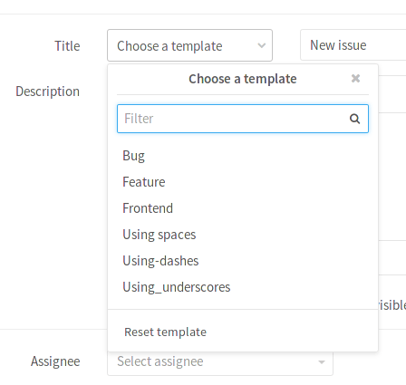

# Description templates

>[Introduced][ce-4981] in GitLab 8.11.

Description templates allow you to define context-specific templates for issue
and merge request description fields for your project.

## Overview

By using the description templates, users that create a new issue or merge
request can select a description template to help them communicate with other
contributors effectively.

Every GitLab project can define its own set of description templates as they
are added to the root directory of a GitLab project's repository.

Description templates must be written in [Markdown](../markdown.md) and stored
in your project's repository under a directory named `.gitlab`. Only the
templates of the default branch will be taken into account.

## Creating issue templates

Create a new Markdown (`.md`) file inside the `.gitlab/issue_templates/`
directory in your repository. Commit and push to your default branch.

## Creating merge request templates

Similarly to issue templates, create a new Markdown (`.md`) file inside the
`.gitlab/merge_request_templates/` directory in your repository. Commit and
push to your default branch.

## Using the templates

Let's take for example that you've created the file `.gitlab/issue_templates/Bug.md`.
This will enable the `Bug` dropdown option when creating or editing issues. When
`Bug` is selected, the content from the `Bug.md` template file will be copied
to the issue description field. The 'Reset template' button will discard any
changes you made after picking the template and return it to its initial status.



## Description template example

We make use of Description Templates for Issues and Merge Requests within the GitLab Community Edition project. Please refer to the [`.gitlab` folder][gitlab-ce-templates] for some examples.

> **Tip:**
It is possible to use [quick actions](./quick_actions.md) within description templates to quickly add labels, assignees, and milestones. The quick actions will only be executed if the user submitting the Issue or Merge Request has the permissions perform the relevant actions.

Here is an example for a Bug report template:

```
Summary

(Summarize the bug encountered concisely)


Steps to reproduce

(How one can reproduce the issue - this is very important)


Example Project

(If possible, please create an example project here on GitLab.com that exhibits the problematic behaviour, and link to it here in the bug report)

(If you are using an older version of GitLab, this will also determine whether the bug has been fixed in a more recent version)


What is the current bug behavior?

(What actually happens)


What is the expected correct behavior?

(What you should see instead)


Relevant logs and/or screenshots

(Paste any relevant logs - please use code blocks (```) to format console output,
logs, and code as it's very hard to read otherwise.)


Possible fixes

(If you can, link to the line of code that might be responsible for the problem)

/label ~bug ~reproduced ~needs-investigation
/cc @project-manager
/assign @qa-tester
```

[ce-4981]: https://gitlab.com/gitlab-org/gitlab-ce/merge_requests/4981
[gitlab-ce-templates]: https://gitlab.com/gitlab-org/gitlab-ce/tree/master/.gitlab

