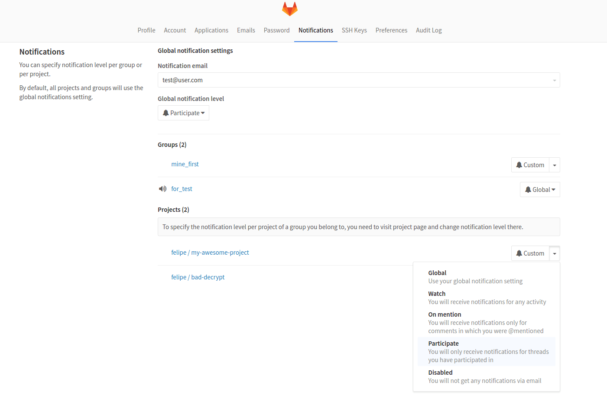
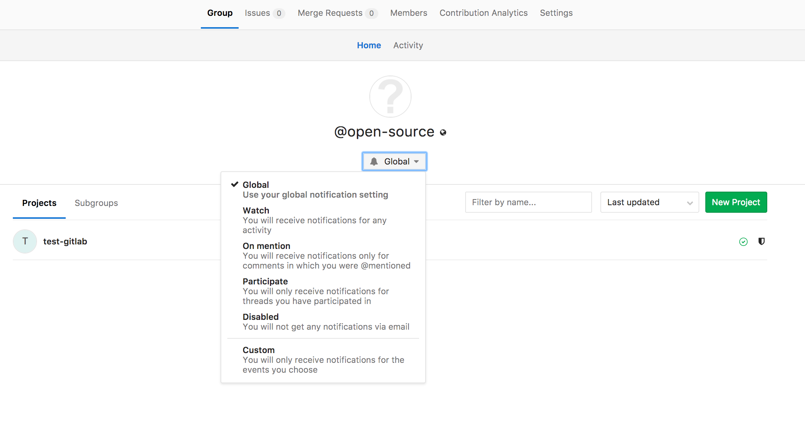
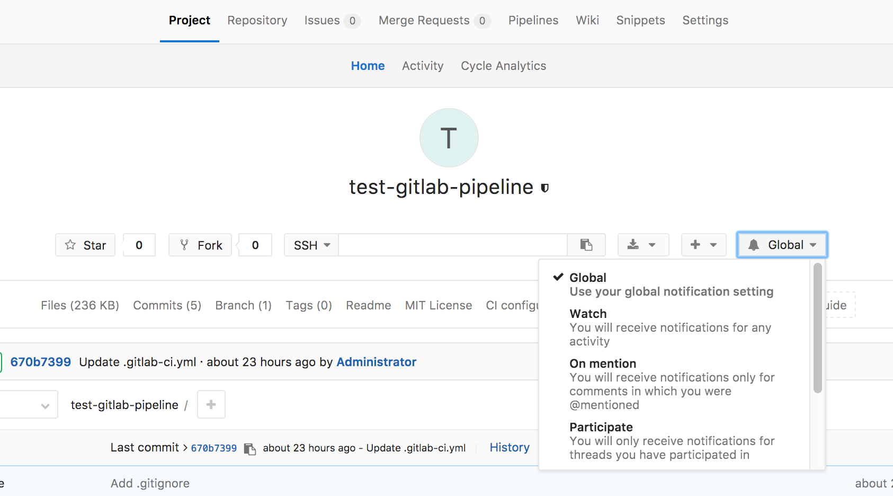

# GitLab Notification Emails

GitLab has a notification system in place to notify a user of events that are important for the workflow.

## Notification settings

You can find notification settings under the user profile.



Notification settings are divided into three groups:

* Global Settings
* Group Settings
* Project Settings

Each of these settings have levels of notification:

* Disabled - turns off notifications
* Participating - receive notifications from related resources
* Watch - receive notifications from projects or groups user is a member of
* Global - notifications as set at the global settings
* Custom - user will receive notifications when mentioned, is participant and custom selected events.

#### Global Settings

Global Settings are at the bottom of the hierarchy.
Any setting set here will be overridden by a setting at the group or a project level.

Group or Project settings can use `global` notification setting which will then use
anything that is set at Global Settings.

#### Group Settings



Group Settings are taking precedence over Global Settings but are on a level below Project or Subgroup Settings:

```
Group < Subgroup < Project
```

This means that you can set a different level of notifications per group while still being able
to have a finer level setting per project or subgroup.
Organization like this is suitable for users that belong to different groups but don't have the
same need for being notified for every group they are member of.
These settings can be configured on group page under the name of the group. It will be the dropdown with the bell icon. They can also be configured on the user profile notifications dropdown.

#### Project Settings



Project Settings are at the top level and any setting placed at this level will take precedence of any
other setting.
This is suitable for users that have different needs for notifications per project basis.
These settings can be configured on project page under the name of the project. It will be the dropdown with the bell icon. They can also be configured on the user profile notifications dropdown.

## Notification events

Below is the table of events users can be notified of:

| Event                        | Sent to                                                           | Settings level               |
|------------------------------|-------------------------------------------------------------------|------------------------------|
| New SSH key added            | User                                                              | Security email, always sent. |
| New email added              | User                                                              | Security email, always sent. |
| New user created             | User                                                              | Sent on user creation, except for omniauth (LDAP)|
| User added to project        | User                                                              | Sent when user is added to project |
| Project access level changed | User                                                              | Sent when user project access level is changed |
| User added to group          | User                                                              | Sent when user is added to group |
| Group access level changed   | User                                                              | Sent when user group access level is changed |
| Project moved                | Project members [1]                                               | [1] not disabled |

### Issue / Merge request events

In most of the below cases, the notification will be sent to:
- Participants:
  - the author and assignee of the issue/merge request
  - authors of comments on the issue/merge request
  - anyone mentioned by `@username` in the issue/merge request title or description
  - anyone mentioned by `@username` in any of the comments on the issue/merge request

    ...with notification level "Participating" or higher

- Watchers: users with notification level "Watch"
- Subscribers: anyone who manually subscribed to the issue/merge request
- Custom: Users with notification level "custom" who turned on notifications for any of the events present in the table below

| Event                  | Sent to |
|------------------------|---------|
| New issue              | |
| Close issue            | |
| Reassign issue         | The above, plus the old assignee |
| Reopen issue           | |
| Due issue              | Participants and Custom notification level with this event selected |
| New merge request      | |
| Push to merge request  | Participants and Custom notification level with this event selected |
| Reassign merge request | The above, plus the old assignee |
| Close merge request    | |
| Reopen merge request   | |
| Merge merge request    | |
| New comment            | The above, plus anyone mentioned by `@username` in the comment, with notification level "Mention" or higher |
| Failed pipeline        | The author of the pipeline |
| Successful pipeline    | The author of the pipeline, if they have the custom notification setting for successful pipelines set |

In addition, if the title or description of an Issue or Merge Request is
changed, notifications will be sent to any **new** mentions by `@username` as
if they had been mentioned in the original text.

You won't receive notifications for Issues, Merge Requests or Milestones created
by yourself (except when an issue is due). You will only receive automatic
notifications when somebody else comments or adds changes to the ones that
you've created or mentions you.

If an open merge request becomes unmergeable due to conflict, its author will be notified about the cause.
If a user has also set the merge request to automatically merge once pipeline succeeds,
then that user will also be notified.

### Email Headers

Notification emails include headers that provide extra content about the notification received:

| Header                      | Description                                                             |
|-----------------------------|-------------------------------------------------------------------------|
| X-GitLab-Project            | The name of the project the notification belongs to                     |
| X-GitLab-Project-Id         | The ID of the project                                                   |
| X-GitLab-Project-Path       | The path of the project                                                 |
| X-GitLab-(Resource)-ID      | The ID of the resource the notification is for, where resource is `Issue`, `MergeRequest`, `Commit`, etc|
| X-GitLab-Discussion-ID      | Only in comment emails, the ID of the discussion the comment is from    |
| X-GitLab-Pipeline-Id        | Only in pipeline emails, the ID of the pipeline the notification is for |
| X-GitLab-Reply-Key          | A unique token to support reply by email                                |
| X-GitLab-NotificationReason | The reason for being notified. "mentioned", "assigned", etc             |

#### X-GitLab-NotificationReason
This header holds the reason for the notification to have been sent out,
where reason can be `mentioned`, `assigned`, `own_activity`, etc.
Only one reason is sent out according to its priority:
- `own_activity`
- `assigned`
- `mentioned`

The reason in this header will also be shown in the footer of the notification email.  For example an email with the
reason `assigned` will have this sentence in the footer:
`"You are receiving this email because you have been assigned an item on {configured GitLab hostname}"`

**Note: Only reasons listed above have been implemented so far**
Further implementation is [being discussed here](https://gitlab.com/gitlab-org/gitlab-ce/issues/42062)
